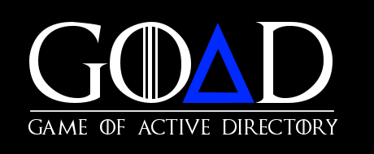
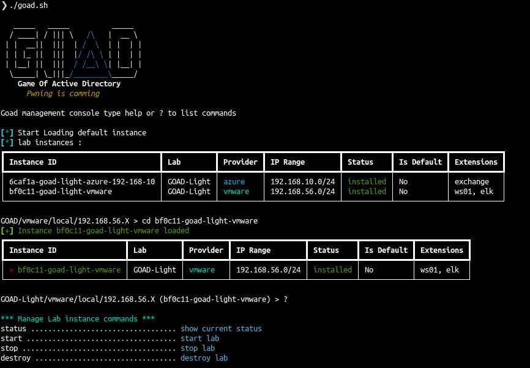
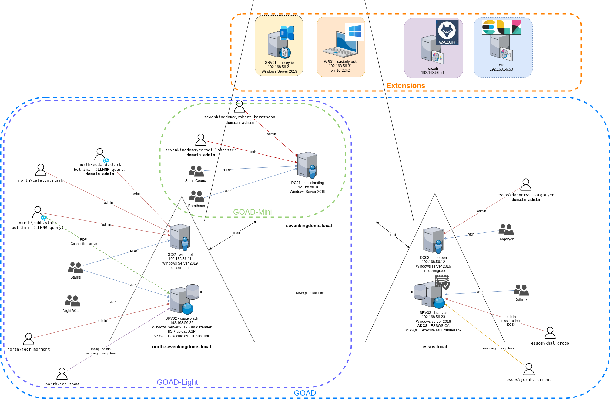
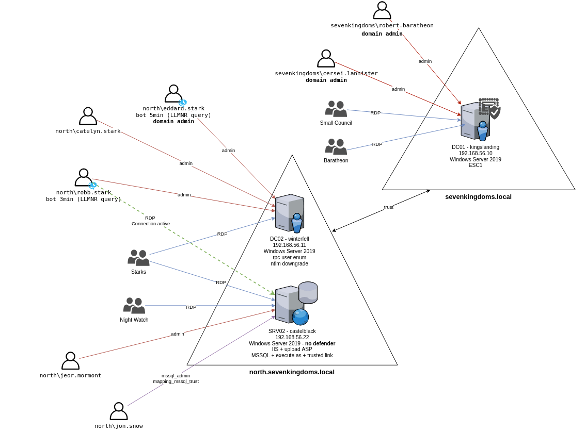
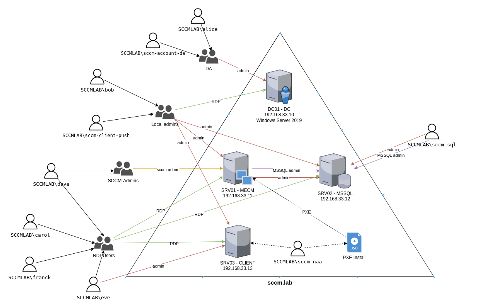
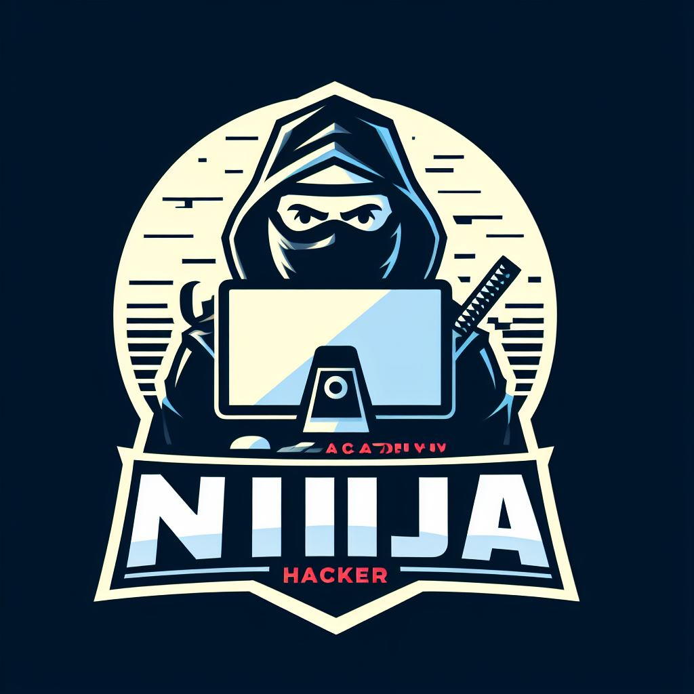
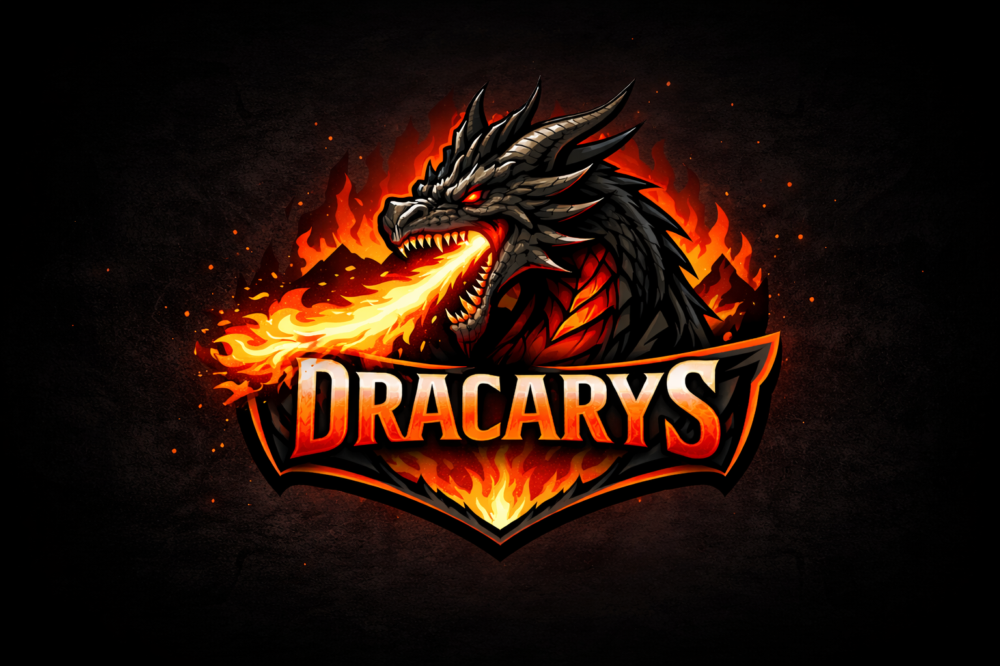

  <h1></h1>
   

**SENGOAD** — a Sengoku-jidai reskin of GOAD (v3)

:bookmark: Documentation : [https://orange-cyberdefense.github.io/GOAD/](https://orange-cyberdefense.github.io/GOAD/)

## 🏯 SENGOAD — Sengoku Jidai reskin

SENGOAD re-skins the lab's *Game of Thrones* names to the Japanese **Sengoku Jidai** (Warring States) period — famous clans and warlords (Oda, Toyotomi, Takeda, Mōri, …) with **kanji display names**. See the full name correspondence:

- 🗾 [GOAD → SENGOAD mapping (English)](./docs/SENGOAD_mapping_EN.md)
- 🇯🇵 [GOAD → SENGOAD 対応表（日本語）](./docs/SENGOAD_mapping_JA.md)

## Description
SENGOAD is a Sengoku-jidai reskin of GOAD — a pentest Active Directory lab.
The purpose of this lab is to give pentesters a vulnerable Active directory environment ready to use to practice usual attack techniques.

> [!CAUTION]
> This lab is extremely vulnerable, do not reuse recipe to build your environment and do not deploy this environment on internet without isolation (this is a recommendation, use it as your own risk). 
> This repository was build for pentest practice.

## Licenses
This lab use free Windows VM only (180 days). After that delay enter a license on each server or rebuild all the lab (may be it's time for an update ;))

## Available labs

- GOAD Lab family and extensions overview

- [SENGOAD](https://orange-cyberdefense.github.io/GOAD/labs/GOAD/) : 5 vms, 2 forests, 3 domains (full SENGOAD lab)

- [SENGOAD-Light](https://orange-cyberdefense.github.io/GOAD/labs/GOAD-Light/) : 3 vms, 1 forest, 2 domains (smaller SENGOAD lab for those with a smaller pc)

- [MINILAB](https://orange-cyberdefense.github.io/GOAD/labs/MINILAB/): 2 vms, 1 forest, 1 domain (basic lab with one DC (windows server 2019) and one Workstation (windows 10))

- [SCCM](https://orange-cyberdefense.github.io/GOAD/labs/SCCM/) : 4 vms, 1 forest, 1 domain, with microsoft configuration manager installed

- [NHA](https://orange-cyberdefense.github.io/GOAD/labs/NHA/) : A challenge with 5 vms and 2 domains. no schema provided, you will have to find out how break it.

- [DRACARYS](https://orange-cyberdefense.github.io/GOAD/labs/DRACARYS/) : A challenge with 3 vms and 1 domains. no schema provided, you will have to find out how break it.

