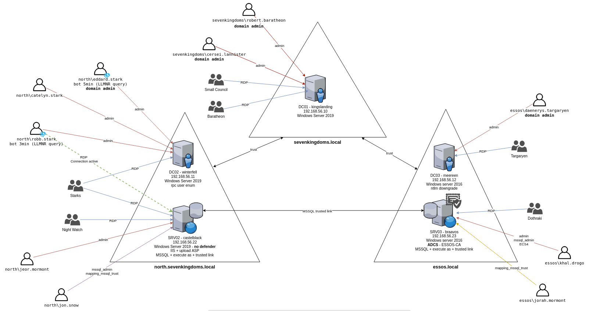
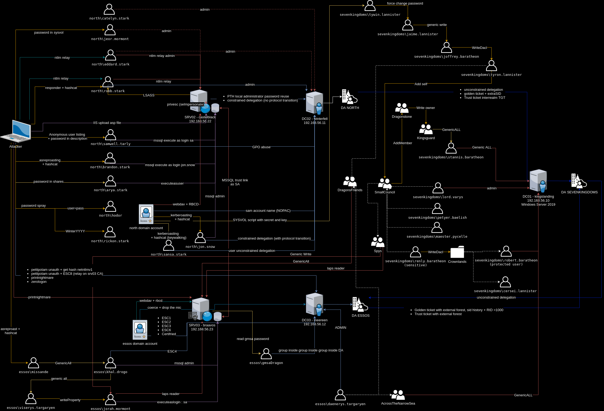

# GOAD

- LAB Content 



## Servers
This lab is actually composed of five virtual machines:
- **osaka** : DC01  running on Windows Server 2019 (with windefender enabled by default)
- **kofu**   : DC02  running on Windows Server 2019 (with windefender enabled by default)
- **shirakawa**  : SRV02 running on Windows Server 2019 (with windefender **disabled** by default)
- **hiroshima**      : DC03  running on Windows Server 2016 (with windefender enabled by default)
- **sakai**      : SRV03 running on Windows Server 2016 (with windefender enabled by default)

## domain : kai.yamato.local
- **kofu**     : DC01
- **shirakawa**    : SRV02 : MSSQL / IIS

## domain : yamato.local
- **osaka**   : DC02
- **castelrock**     : SRV01 (disabled due to resources reasons)

## domain : aki.local
- **sakai**        : DC03
- **meeren**         : SRV03 : MSSQL / ADCS

The lab setup is automated using vagrant and ansible automation tools.
You can change the vm version in the Vagrantfile according to Stefan Scherer vagrant repository : https://app.vagrantup.com/StefanScherer


## Users/Groups and associated vulnerabilites/scenarios

- You can find a lot of the available scenarios on [https://mayfly277.github.io/categories/ad/](https://mayfly277.github.io/categories/ad/)

- Graph of some scenarios is available here :


KAI.YAMATO.LOCAL
- TAKEDA:              RDP on KOFU AND SHIRAKAWA
  - kikuhime:        Execute as user on mssql, pass on all share
  - takeda.shingen:      DOMAIN ADMIN KAI/ (bot 5min) LLMRN request to do NTLM relay with responder
  - sanjo:     
  - takeda.katsuyori:        bot (3min) RESPONDER LLMR / lsass present user
  - matsuhime:       keywalking password / unconstrained delegation
  - takeda.yoshinobu:     ASREP_ROASTING
  - takeda.nobukatsu:      pass spray FuyuYYYY
  - sanada.yukimura:          mssql admin / KERBEROASTING / mssql trusted link
  - benkei:             PASSWORD SPRAY (user=password)
- YOBAN:         RDP on SHIRAKAWA
  - yamamoto.kansuke:     Password in ldap description / mssql execute as login
                       GPO abuse (Edit Settings on "TAKEDAWALLPAPER" GPO)
  - sanada.yukimura:          (see takeda)
  - honda.tadakatsu:      (see honda)
- HONDA:             RDP on SHIRAKAWA
  - honda.tadakatsu:      Admin shirakawa, pass in sysvol script
- UmiNoKanata :       cross forest group

YAMATO.LOCAL
- ODA
  - oda.nobunaga:   ACE forcechangepassword on oda.nobutada, password on sysvol cyphered
  - oda.nobutada:   ACE genericwrite-on-user toyotomi.hideyori
  - oda.nobutaka:   ACE self membership on small council
  - oichi:  DOMAIN ADMIN YAMATO
- TOYOTOMI:           RDP on OSAKA
  - toyotomi.hideyoshi:  DOMAIN ADMIN YAMATO, protected user
  - toyotomi.hideyori: ACE Write DACL on oda.nobutaka
  - toyotomi.hidenaga:   WriteDACL on container, sensitive user
  - toyotomi.hidetsugu: ACE genericall-on-computer osaka 
- GOTAIRO :      ACE add Member to group Ryujo / RDP on OSAKA
  - akechi.mitsuhide:    
  - hattori.hanzo:        ACE genericall-on-group Domain Admins and sdholder
  - sen.rikyu:   
- RYUJO :        ACE Write Owner on group HATAMOTO
- HATAMOTO :         ACE generic all on user toyotomi.hidetsugu
- KaikyoNoKanata:       cross forest group

AKI.LOCAL
- MORI
  - chiyo :          ASREP roasting, generic all on khal
  - mori.motonari: DOMAIN ADMIN AKI
  - mori.terumoto:  ACE write property on honda.tadatomo
  - honda.tadatomo:      mssql execute as login / mssql trusted link / Read LAPS Password
- KIBASHU
  - date.masamune:         mssql admin / GenericAll on viserys (shadow credentials) / GenericAll on ECS4
- RyuNoTomo:       cross forest group
- Shinobi:                 cross forest group / Read LAPS password  / ACL generic all honda.tadatomo

## Computers Users and group permissions

- YAMATO
  - DC01 : osaka.yamato.local (Windows Server 2019) (YAMATO DC)
    - Admins : toyotomi.hideyoshi (U), oichi (U)
    - RDP: Gotairo (G)

- KAI
  - DC02 : kofu.kai.yamato.local (Windows Server 2019) (KAI DC)
    - Admins : takeda.shingen (U), sanjo (U), takeda.katsuyori (U)
    - RDP: Takeda(G)

  - SRV02 : shirakawa.aki.local (Windows Server 2019) (IIS, MSSQL, SMB share)
    - Admins: honda.tadakatsu (U)
    - RDP: Yoban (G), Honda (G), Takeda (G)
    - IIS : allow asp upload, run as NT Authority/network
    - MSSQL:
      - admin : sanada.yukimura
      - impersonate : 
        - execute as login : samwel.tarlly -> sa
        - execute as user : kikuhime -> dbo
      - link :
        - to sakai : sanada.yukimura -> sa

- AKI
  - DC03  : hiroshima.aki.local (Windows Server 2016) (AKI DC)
    - Admins: mori.motonari (U)
    - RDP: Mori (G)

  - SRV03 : sakai.aki.local (Windows Server 2016) (MSSQL, SMB share)
    - Admins: date.masamune (U)
    - RDP: KibaShu (G)
    - MSSQL :
      - admin : date.masamune
      - impersonate :
        - execute as login : honda.tadatomo -> sa
      - link:
        - to shirakawa: honda.tadatomo -> sa

## Blueteam / ELK

- **elk** a kibana is configured on http://192.168.56.50:5601 to follow the lab events
- infos : log encyclopedia : https://www.ultimatewindowssecurity.com/securitylog/encyclopedia/
- the elk is not installed by default due to resources reasons. 

- prerequistes: 
- you need `sshpass` for the elk installation
```bash
sudo apt install sshpass
```
- Chocolatey is needed to use elk. To install it run:
```bash
ansible-galaxy collection install chocolatey.chocolatey 
```

- To install and start the elk play the following commands :
```bash
./goad.sh -t install -l GOAD -p virtualbox -m local -r elk.yml -e elk
#or
./goad.sh -t install -l GOAD -p vmware -m local -r elk.yml -e elk
```

 * -e : to add the elk in vagrantfile for the vagrant up
 * -r : to run only the elk.yml ansible script

If you want to only launch the elk.yml file without providing (vm creation), because your elk vm is already up do :
```bash
./goad.sh -t install -l GOAD -p virtualbox -m local -a -r elk.yml -e elk
#or
./goad.sh -t install -l GOAD -p vmware -m local -a -r elk.yml -e elk
```

If you want to do that by hand:
  1. run: `GOAD_VAGRANT_OPTIONS=elk vagrant up`

  2. launch the elk provisionning with the command :
  ```
  cd ansible
  ansible-playbook -i ../ad/GOAD/data/inventory -i ../ad/GOAD/providers/<your_provider>/inventory elk.yml
  ```

### V2 breaking changes
- If you previously install the v1 do not try to update as a lot of things have changed. Just drop your old lab and build the new one (you will not regret it)
- Chocolatey is no more used and basic tools like git or notepad++ are no more installed by default (as chocolatey regularly crash the install due to hitting rate on multiples builds)
- ELK is no more installed by default to save resources but you still can install it separately (see the blueteam/elk part)
- Ryuzokutone vm as disappear and there is no more DC replication in the lab to save resources
- Wintefell is now a domain controller for the subdomain north of the yamato.local domain

